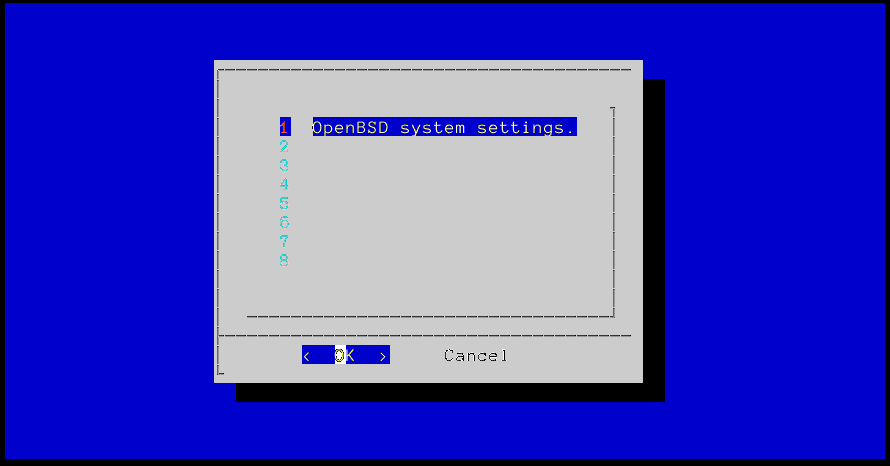

OpenHome
========

Interactive scripts for managing a home OpenBSD server.

## Help

dynu

    Usage: dynu ...
    
    Manage DNS bindings in `www.dynu.com`. Please set the token
    with DYNU_API_KEY or /etc/tokens/dynu.
    
    ... show                       : Show configuration.
    ... web                        : Open dashboard.
    ... public-ip                  : Get public IP address.
    ... domain-ls                  : List domains.
    ... domain-id  DOMAIN          : Get domain's ID.
    ... domain-set DOMAIN [IPADDR] : Assign IP address to domain.

htodo-openbsd-sysupgrade

    Usage: htodo-openbsd-sysupgrade
    
    Check whether any OpenBSD machine defined in HTODO_OPENBSD_SYSUPGRADE requires
    an upgrade.

iso_openbsd

    Usage: iso_openbsd ...
    
    Consult "https://www.openbsd.org/faq/faq4.html" to know which version
    is the latest and download installation images.
    
      last_version            Get the last version.
      get_url IMAGE [amd64]   Get image's download URL.
      get_img IMAGE [amd64]   Download to "${DDIR:-/tmp}" and print path.
    
    For installation via flash drive use "install.iso".
    
    Supported images: install.{img,iso} miniroot.img cd.iso floppy.img

oh

    Usage: oh : Launch the main menu.

oh_cron

    Usage: oh_cron
    
    Interactive cron management.

oh_ddns

    Usage: oh_ddns [-u]
    
    Interactive DDNS management. (Only dynu is supported)

oh_haproxy

    Usage: oh_haproxy
    
    Interactive haproxy service configuration wizard.

oh_login

    Usage: oh_login
    
    Wizard for configuring SSHD login.

oh_msmtp

    Usage: oh_msmtp
    
    Interactive msmtp(1) mail client configuration wizard.

oh_postgresql

    Usage: oh_postgresql
    
    Interactive PostgreSQL server configuration wizard.

oh_system

    Usage: oh_system
    
    OpenBSD system configuration wizard.

ohu_canfail

    Usage: ohu_canfail [-e] COMMAND
    
      -v : Print the command executed.
      -e : Pause if the command fail.
      -s : Pause after the command.
      -r : Return failure if the command fails.
    
    Allow command to fail. With [-e] it will ask the user to type
    enter. Use this in menus.

ohu_dialog

    Usage: ohu_dialog [@] ARGS ...
    
    Execute dialog(1) with "--backtitle" set. If the first argument
    is @ then the result is saved in SEL (only when sourced).
    
    Environment variables: OHU_BACKTITLE.
    When sourced: ohu_dialog_cols, ohu_dialog_lines

ohu_download

    Usage: ohu_download [-o FILE] URL

ohu_edit

    Usage: ohu_edit [-a HELP] FILES...
    
    Open files for edition, provide HELP in another frame
    to assist the edition.

ohu_is_os

    Usage: ohu_is_os [-q] [-s OS] [-d DISTRO] [-S|D]
    
    Check the operating system is OS or the Linux distribution
    is DISTRO. If -q is specified no message error is printed.
    
    With -S|D it prints the OS or the distro. Multiple options of
    -s|d can be specified.
    
    When sourced OHU_SYSTEM and OHU_DISTRO are available.

ohu_is_root

    Usage: ohu_is_root
    
    Print an error when not executed as root.
    
    Environment variables: OHU_BACKTITLE.

oh_unbound

    Usage: oh_unbound
    
    Interactive DNS server (unbound) configuration wizard.

ohu_sysctl

    Usage: ohu_sysctl VARIABLE VALUE

ohu_vrun

    Usage: ohu_vrun COMMAND

oh_wireguard

    Usage: oh_wireguard
    
    Interactive Wireguard VPN service configuration wizard.

## Collaborating

For making bug reports, feature requests, support or consulting visit
one of the following links:

1. [gemini://harkadev.com/oss/](gemini://harkadev.com/oss/)
2. [https://harkadev.com/oss/](https://harkadev.com/oss/)
